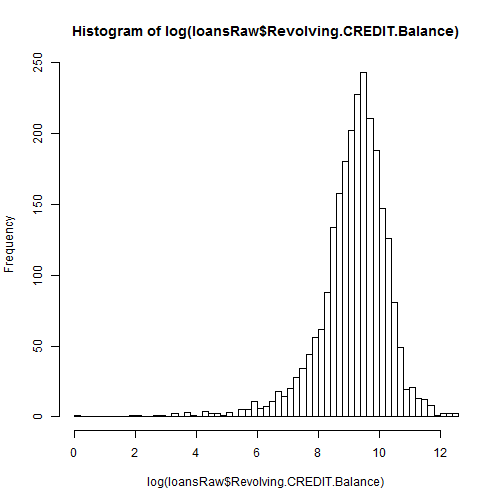
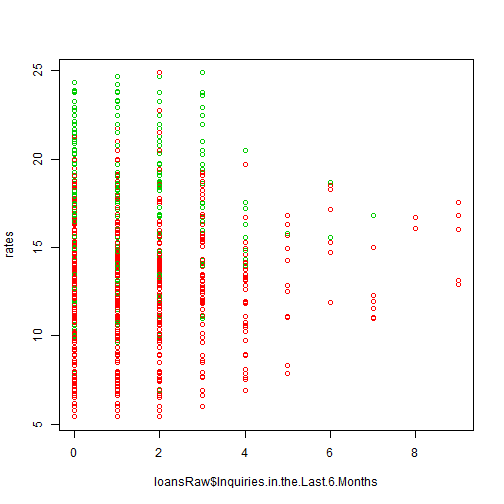
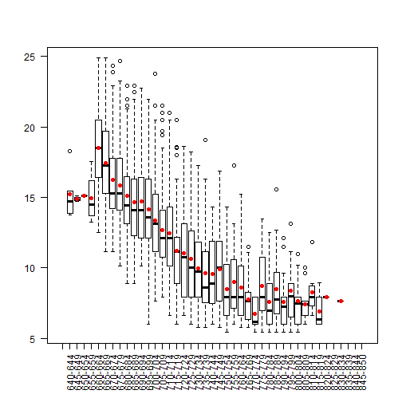
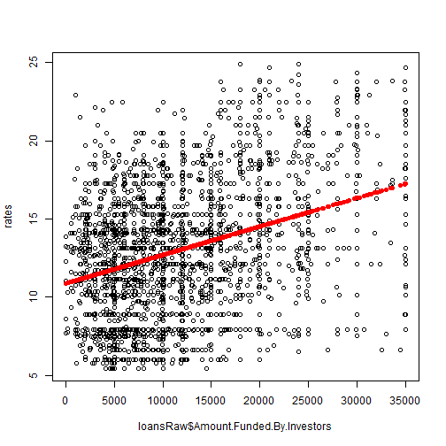
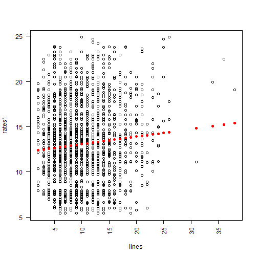
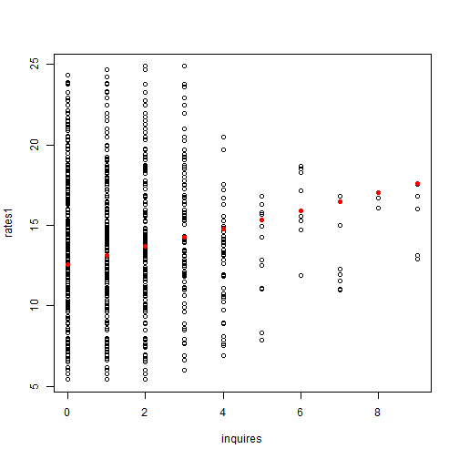

Raw Loan Analysis
========================

### Load libraries


```r
# library(RColorBrewer)
```


  
## Processing

Download the data, read the data in and save the raw data as an RDA file


```r
getwd()
```

```
## [1] "C:/dev/coursera/cour-dataanalysis/a1/code/finalcode"
```

```r
download.file("https://spark-public.s3.amazonaws.com/dataanalysis/loansData.rda", 
    destfile = "../../data/loans.rda", method = "curl")
```

```
## Warning: download had nonzero exit status
```

```r
date()
```

```
## [1] "Sun Feb 17 22:36:49 2013"
```

```r
load("../../data/loans.rda")
loansRaw <- loansData
```


### Look at the data set


```r
head(loansRaw)
```

```
##       Amount.Requested Amount.Funded.By.Investors Interest.Rate
## 81174            20000                      20000         8.90%
## 99592            19200                      19200        12.12%
## 80059            35000                      35000        21.98%
## 15825            10000                       9975         9.99%
## 33182            12000                      12000        11.71%
## 62403             6000                       6000        15.31%
##       Loan.Length       Loan.Purpose Debt.To.Income.Ratio State
## 81174   36 months debt_consolidation               14.90%    SC
## 99592   36 months debt_consolidation               28.36%    TX
## 80059   60 months debt_consolidation               23.81%    CA
## 15825   36 months debt_consolidation               14.30%    KS
## 33182   36 months        credit_card               18.78%    NJ
## 62403   36 months              other               20.05%    CT
##       Home.Ownership Monthly.Income FICO.Range Open.CREDIT.Lines
## 81174       MORTGAGE           6542    735-739                14
## 99592       MORTGAGE           4583    715-719                12
## 80059       MORTGAGE          11500    690-694                14
## 15825       MORTGAGE           3833    695-699                10
## 33182           RENT           3195    695-699                11
## 62403            OWN           4892    670-674                17
##       Revolving.CREDIT.Balance Inquiries.in.the.Last.6.Months
## 81174                    14272                              2
## 99592                    11140                              1
## 80059                    21977                              1
## 15825                     9346                              0
## 33182                    14469                              0
## 62403                    10391                              2
##       Employment.Length
## 81174          < 1 year
## 99592           2 years
## 80059           2 years
## 15825           5 years
## 33182           9 years
## 62403           3 years
```

```r
summary(loansRaw)
```

```
##  Amount.Requested Amount.Funded.By.Investors Interest.Rate 
##  Min.   : 1000    Min.   :    0              12.12% : 122  
##  1st Qu.: 6000    1st Qu.: 6000              7.90%  : 119  
##  Median :10000    Median :10000              13.11% : 115  
##  Mean   :12406    Mean   :12002              15.31% :  76  
##  3rd Qu.:17000    3rd Qu.:16000              14.09% :  72  
##  Max.   :35000    Max.   :35000              14.33% :  69  
##                                              (Other):1927  
##     Loan.Length               Loan.Purpose  Debt.To.Income.Ratio
##           :   0   debt_consolidation:1307   0%     :   8        
##  36 months:1952   credit_card       : 444   12.54% :   6        
##  60 months: 548   other             : 201   12.20% :   5        
##                   home_improvement  : 152   12.85% :   5        
##                   major_purchase    : 101   14.22% :   5        
##                   small_business    :  87   14.66% :   5        
##                   (Other)           : 208   (Other):2466        
##      State       Home.Ownership Monthly.Income     FICO.Range  
##  CA     : 433           :   0   Min.   :   588   670-674: 171  
##  NY     : 255   MORTGAGE:1148   1st Qu.:  3500   675-679: 166  
##  TX     : 174   NONE    :   1   Median :  5000   680-684: 157  
##  FL     : 169   OTHER   :   5   Mean   :  5689   695-699: 153  
##  IL     : 101   OWN     : 200   3rd Qu.:  6800   665-669: 145  
##  GA     :  98   RENT    :1146   Max.   :102750   690-694: 140  
##  (Other):1270                   NA's   :1        (Other):1568  
##  Open.CREDIT.Lines Revolving.CREDIT.Balance Inquiries.in.the.Last.6.Months
##  Min.   : 2.0      Min.   :     0           Min.   :0.000                 
##  1st Qu.: 7.0      1st Qu.:  5586           1st Qu.:0.000                 
##  Median : 9.0      Median : 10962           Median :0.000                 
##  Mean   :10.1      Mean   : 15245           Mean   :0.906                 
##  3rd Qu.:13.0      3rd Qu.: 18889           3rd Qu.:1.000                 
##  Max.   :38.0      Max.   :270800           Max.   :9.000                 
##  NA's   :2         NA's   :2                NA's   :2                     
##  Employment.Length
##  10+ years:653    
##  < 1 year :250    
##  2 years  :244    
##  3 years  :235    
##  5 years  :202    
##  4 years  :192    
##  (Other)  :724
```

```r
sapply(loansRaw[1, ], class)
```

```
##               Amount.Requested     Amount.Funded.By.Investors 
##                      "integer"                      "numeric" 
##                  Interest.Rate                    Loan.Length 
##                       "factor"                       "factor" 
##                   Loan.Purpose           Debt.To.Income.Ratio 
##                       "factor"                       "factor" 
##                          State                 Home.Ownership 
##                       "factor"                       "factor" 
##                 Monthly.Income                     FICO.Range 
##                      "numeric"                       "factor" 
##              Open.CREDIT.Lines       Revolving.CREDIT.Balance 
##                      "integer"                      "integer" 
## Inquiries.in.the.Last.6.Months              Employment.Length 
##                      "integer"                       "factor"
```


### Find out about missing values

```r
sum(is.na(loansRaw))
```

```
## [1] 7
```


### Find minimum and maximum interest rates

```r
rates <- as.numeric(sub("%", "", loansRaw$Interest.Rate))
min(rates)
```

```
## [1] 5.42
```

```r
max(rates)
```

```
## [1] 24.89
```


--------------------------

## Exploratory analysis

### Make some univariate plots/summaries


```r
hist(rates)
```

 

```r
hist(log(loansRaw$Monthly.Income), breaks = 50)
```

 

```r
plot(loansRaw$FICO.Range, las = 2)
```

 

```r
hist(loansRaw$Amount.Funded.By.Investors)
```

 

```r
hist(loansRaw$Open.CREDIT.Lines)
```

 

```r
hist(log(loansRaw$Revolving.CREDIT.Balance), breaks = 50)
```

 

```r
plot(loansRaw$Employment.Length, las = 2)
```

 


### Make some univariate tables

```r
table(loansRaw$FICO.Range)
```

```
## 
##         640-644 645-649 650-654 655-659 660-664 665-669 670-674 675-679 
##       0       5       3       1       4     125     145     171     166 
## 680-684 685-689 690-694 695-699 700-704 705-709 710-714 715-719 720-724 
##     157     138     140     153     131     134     112      93     114 
## 725-729 730-734 735-739 740-744 745-749 750-754 755-759 760-764 765-769 
##      94      94      65      53      54      61      46      46      36 
## 770-774 775-779 780-784 785-789 790-794 795-799 800-804 805-809 810-814 
##      17      22      28      19      20      13      13      11       8 
## 815-819 820-824 825-829 830-834 835-839 840-844 845-850 
##       6       1       0       1       0       0       0
```

```r
table(loansRaw$Interest.Rate)
```

```
## 
##        10.00% 10.01% 10.08% 10.14% 10.16% 10.20% 10.25% 10.28% 10.33% 
##      0      8      0      2      0     48      1      8      1      0 
## 10.36% 10.37% 10.38% 10.39% 10.46% 10.51% 10.59% 10.62% 10.64% 10.65% 
##      8      8     12      0      1      0     13      5      0     14 
## 10.71% 10.74% 10.75% 10.78% 10.83% 10.91% 10.95% 10.96% 10.99% 11.03% 
##      0     24     11      0      2      1      1      0     20      4 
## 11.09% 11.11% 11.12% 11.14% 11.22% 11.26% 11.28% 11.34% 11.36% 11.41% 
##      1      6      8     58      0      2      0      0      4      0 
## 11.46% 11.48% 11.49% 11.54% 11.58% 11.59% 11.63% 11.66% 11.71% 11.72% 
##      0      6     21      1      2      1      0      1     36      0 
## 11.78% 11.83% 11.86% 11.89% 11.91% 11.97% 11.99% 12.04% 12.09% 12.12% 
##      2      8      7      9      0      3     14      0      0    122 
## 12.17% 12.18% 12.21% 12.22% 12.23% 12.29% 12.36% 12.41% 12.42% 12.49% 
##      0      4      5      0      3      2      0      1     17      1 
## 12.53% 12.54% 12.61% 12.62% 12.67% 12.68% 12.69% 12.72% 12.73% 12.80% 
##     10      0      5      0      0      7     21      0      2      0 
## 12.84% 12.86% 12.87% 12.92% 12.98% 12.99% 13.04% 13.06% 13.11% 13.12% 
##      5      1      4      3      4      6      0      8    115      1 
## 13.16% 13.17% 13.22% 13.23% 13.24% 13.30% 13.35% 13.36% 13.43% 13.47% 
##      4      1      2      5      2      2      2      0      4      3 
## 13.48% 13.49% 13.55% 13.57% 13.61% 13.62% 13.67% 13.72% 13.75% 13.79% 
##      4     25      1      1      2      0     23      2      2      2 
## 13.80% 13.84% 13.85% 13.87% 13.92% 13.93% 13.98% 13.99% 14.07% 14.09% 
##      1      0      4      2      2      1      8     29      2     72 
## 14.11% 14.12% 14.17% 14.18% 14.22% 14.25% 14.26% 14.27% 14.30% 14.33% 
##      7      1      3      1      4      0      2     18      0     69 
## 14.35% 14.38% 14.42% 14.43% 14.46% 14.50% 14.54% 14.57% 14.59% 14.61% 
##      4      0      2      0      3      1      0      0      5      4 
## 14.62% 14.65% 14.67% 14.70% 14.72% 14.74% 14.75% 14.79% 14.82% 14.83% 
##      0     29      0      2      3      2      0      2      2      3 
## 14.84% 14.88% 14.91% 14.93% 14.96% 15.01% 15.05% 15.07% 15.13% 15.20% 
##      2      0      5      0      6      1      4      0      2      1 
## 15.21% 15.23% 15.25% 15.27% 15.28% 15.31% 15.33% 15.37% 15.38% 15.45% 
##      5      7      0     10      2     76      3      1      0      1 
## 15.51% 15.57% 15.58% 15.62% 15.65% 15.68% 15.70% 15.76% 15.80% 15.81% 
##      0      1      5      3      3      1      1      0     39     10 
## 15.83% 15.88% 15.95% 15.96% 15.99% 16.00% 16.01% 16.02% 16.07% 16.08% 
##      0      0      5     10      7      2      0      2      2      0 
## 16.11% 16.15% 16.20% 16.28% 16.29% 16.32% 16.33% 16.35% 16.40% 16.45% 
##      0      0      0      0     51      8      0      1      2      1 
## 16.46% 16.49% 16.59% 16.63% 16.65% 16.69% 16.70% 16.71% 16.77% 16.82% 
##      0      8      0      1      0      1      1      1     11      5 
## 16.83% 16.89% 16.91% 16.95% 16.96% 17.03% 17.04% 17.06% 17.09% 17.14% 
##      1      9      0      0      0      0      1      0      0      4 
## 17.15% 17.19% 17.22% 17.26% 17.27% 17.28% 17.34% 17.39% 17.41% 17.43% 
##      1      1      0      0     56      0      0      0      0      1 
## 17.44% 17.46% 17.49% 17.51% 17.54% 17.56% 17.58% 17.59% 17.66% 17.72% 
##      1      0     10      3      1      3      6      0      0      0 
## 17.74% 17.77% 17.78% 17.80% 17.86% 17.88% 17.90% 17.91% 17.93% 17.97% 
##      0     38      0      1      0      1      1      0      3      0 
## 17.99% 18.04% 18.07% 18.09% 18.17% 18.21% 18.25% 18.29% 18.30% 18.36% 
##     12      0      0      0      1      0     19      1      1      0 
## 18.39% 18.43% 18.49% 18.53% 18.54% 18.55% 18.61% 18.62% 18.64% 18.67% 
##      3      0     33      0      0      7      0      1      8      2 
## 18.72% 18.75% 18.78% 18.79% 18.84% 18.86% 18.91% 18.99% 19.03% 19.04% 
##      0     17      0      3      0      0      0      0      7      1 
## 19.05% 19.13% 19.16% 19.22% 19.29% 19.36% 19.39% 19.41% 19.42% 19.47% 
##     26      1      0      9      0      0      0      1      3      1 
## 19.66% 19.69% 19.72% 19.74% 19.79% 19.82% 19.91% 19.99% 20.03% 20.11% 
##      0      5     19      2      0      0      5      7      0      0 
## 20.16% 20.17% 20.20% 20.25% 20.30% 20.40% 20.48% 20.49% 20.50% 20.52% 
##      0      0      0      2      3      0      0     18      6      1 
## 20.53% 20.62% 20.69% 20.77% 20.85% 20.86% 20.89% 20.90% 20.99% 21.00% 
##      1      0      0      2      0      0      1      0      1     12 
## 21.14% 21.21% 21.22% 21.27% 21.28% 21.36% 21.48% 21.49% 21.59% 21.64% 
##      1      0      0      1      1      0      4     12      0      0 
## 21.67% 21.74% 21.82% 21.97% 21.98% 22.06% 22.11% 22.35% 22.45% 22.47% 
##      2      2      0      3     10      0      2      0      3     15 
## 22.48% 22.64% 22.74% 22.78% 22.85% 22.94% 22.95% 23.13% 23.22% 23.26% 
##      0      0      0      5      0      0      8      0      0      0 
## 23.28% 23.33% 23.52% 23.59% 23.63% 23.76% 23.83% 23.91% 24.11% 24.20% 
##      7      1      0      0      1      7      2      1      0      1 
## 24.33% 24.40% 24.52% 24.59% 24.70% 24.76% 24.83% 24.89%  5.42%  5.79% 
##      1      0      0      0      2      0      0      2     11     14 
##  5.99%  6.00%  6.03%  6.17%  6.39%  6.54%  6.62%  6.76%  6.91%  6.92% 
##     10      1     57      5      0      6     49      4      9      5 
##  6.99%  7.05%  7.12%  7.14%  7.29%  7.37%  7.40%  7.42%  7.43%  7.49% 
##      9      0      0      7     10      0      3      0      1     23 
##  7.51%  7.62%  7.66%  7.68%  7.74%  7.75%  7.88%  7.90%  7.91%  8.00% 
##     21     34      8      3      5      2     17    119      3      4 
##  8.07%  8.32%  8.38%  8.49%  8.59%  8.63%  8.70%  8.88%  8.90%  8.94% 
##      1      2      0     10      7      2      0      3     64      7 
##  9.01%  9.07%  9.20%  9.25%  9.32%  9.33%  9.38%  9.45%  9.51%  9.62% 
##      0      2      1      3      4      1      0      0      0      3 
##  9.63%  9.64%  9.67%  9.70%  9.76%  9.83%  9.88%  9.91%  9.96%  9.99% 
##     11      0      0      0     21      0      4     13      0     11
```

```r
table(loansRaw$Loan.Length)
```

```
## 
##           36 months 60 months 
##         0      1952       548
```

```r
table(loansRaw$State)
```

```
## 
##      AK  AL  AR  AZ  CA  CO  CT  DC  DE  FL  GA  HI  IA  ID  IL  IN  KS 
##   0  11  38  13  46 433  61  50  11   8 169  98  12   1   0 101   3  21 
##  KY  LA  MA  MD  ME  MI  MN  MO  MS  MT  NC  NE  NH  NJ  NM  NV  NY  OH 
##  23  22  73  68   0  45  38  33   1   7  64   0  15  94  13  32 255  71 
##  OK  OR  PA  RI  SC  SD  TN  TX  UT  VA  VT  WA  WI  WV  WY 
##  21  30  96  15  28   4   0 174  16  78   5  58  26  15   4
```

```r
table(loansRaw$Loan.Purpose)
```

```
## 
##                                   car        credit_card 
##                  0                 50                444 
## debt_consolidation        educational   home_improvement 
##               1307                 15                152 
##              house     major_purchase            medical 
##                 20                101                 30 
##             moving              other   renewable_energy 
##                 29                201                  4 
##     small_business           vacation            wedding 
##                 87                 21                 39
```

```r
table(loansRaw$Home.Ownership)
```

```
## 
##          MORTGAGE     NONE    OTHER      OWN     RENT 
##        0     1148        1        5      200     1146
```

```r
table(loansRaw$Inquiries.in.the.Last.6.Months)
```

```
## 
##    0    1    2    3    4    5    6    7    8    9 
## 1250  657  336  169   50   14    8    7    2    5
```

```r
table(loansRaw$Employment.Length)
```

```
## 
##            < 1 year    1 year 10+ years   2 years   3 years   4 years 
##         0       250       177       653       244       235       192 
##   5 years   6 years   7 years   8 years   9 years       n/a 
##       202       163       127       108        72        77
```


### Plot rate by FICO

```r
plot(loansRaw$FICO.Range, rates, pch = 19, las = 2)
```

 


Have correlation between FICO and Rate.
Than bigger FICO than less Rate. 
FICO is itslef aggregation of other factors.

### Plot Rate by FICO with color groups for loan lengths 

```r
plot(as.numeric(loansRaw$FICO.Range), rates, pch = 19, col = loansRaw$Loan.Length)
```

 

Rates smaller than loan length smaller.

### Plot rate by purpose

```r
plot(loansRaw$Loan.Purpose, rates, las = 2)
```

 

In general car, educational and energy has lower rate, maby because they are short term and then loan length is cofounder here


### Plot rate by Inquiries.in.the.Last.6.Months 

```r
plot(loansRaw$Inquiries.in.the.Last.6.Months, rates, col = loansRaw$Loan.Length)
```

 

Than more quantity of inquires than more rate (at least this works after 3d inquiry)


------

## Modeling

### Fit a rates by FICO.Range

```r
lm1 <- lm(rates ~ loansRaw$FICO.Range)
plot(loansRaw$FICO.Range, rates, las = 2)
points(loansRaw$FICO.Range, lm1$fitted, pch = 19, col = "red")
```

 


###Fit a rates by loansRaw$Amount.Funded.By.Investors

```r
lm4 <- lm(rates ~ loansRaw$Amount.Funded.By.Investors)
plot(loansRaw$Amount.Funded.By.Investors, rates)
points(loansRaw$Amount.Funded.By.Investors, lm4$fitted, pch = 19, col = "red")
```

 


###Fit a rates by Open.CREDIT.Lines

```r
rates1 <- rates[!is.na(loansRaw$Open.CREDIT.Lines)]
lines <- loansRaw$Open.CREDIT.Lines[!is.na(loansRaw$Open.CREDIT.Lines)]
lm10 <- lm(rates1 ~ lines)
plot(lines, rates1, las = 2)
points(lines, lm10$fitted, pch = 19, col = "red")
```

 


###Fit a rates by Inquiries.in.the.Last.6.Months

```r
rates1 <- rates[!is.na(loansRaw$Inquiries.in.the.Last.6.Months)]
inquires <- loansRaw$Inquiries.in.the.Last.6.Months[!is.na(loansRaw$Inquiries.in.the.Last.6.Months)]
lm11 <- lm(rates1 ~ inquires)
plot(inquires, rates1)
points(inquires, lm11$fitted, pch = 19, col = "red")
```

 


## Let's use this model


```r
ratio1 <- cut(ratio, 3)
```

```
## Error: объект 'ratio' не найден
```

```r
range <- cut(as.numeric(loansRaw$FICO.Range), 5)
lines <- cut(as.numeric(loansRaw$Open.CREDIT.Lines), 3)
lmFinal <- lm(rates ~ loansRaw$Amount.Funded.By.Investors + range + loansRaw$Loan.Length + 
    loansRaw$Inquiries.in.the.Last.6.Months + loansRaw$Home.Ownership)
```


## Get the estimates and confidence intervals


```r
## The estimate from summary
summary(lmFinal)
```

```
## 
## Call:
## lm(formula = rates ~ loansRaw$Amount.Funded.By.Investors + range + 
##     loansRaw$Loan.Length + loansRaw$Inquiries.in.the.Last.6.Months + 
##     loansRaw$Home.Ownership)
## 
## Residuals:
##    Min     1Q Median     3Q    Max 
## -8.660 -1.313 -0.169  1.298 10.484 
## 
## Coefficients:
##                                          Estimate Std. Error t value
## (Intercept)                              1.39e+01   1.28e-01  108.04
## loansRaw$Amount.Funded.By.Investors      1.50e-04   6.05e-06   24.82
## range(9.58,17.2]                        -3.44e+00   1.07e-01  -32.11
## range(17.2,24.8]                        -7.07e+00   1.25e-01  -56.47
## range(24.8,32.4]                        -8.62e+00   1.63e-01  -52.74
## range(32.4,40]                          -9.20e+00   3.06e-01  -30.11
## loansRaw$Loan.Length60 months            3.29e+00   1.12e-01   29.50
## loansRaw$Inquiries.in.the.Last.6.Months  4.24e-01   3.47e-02   12.23
## loansRaw$Home.OwnershipOTHER             1.06e+00   9.44e-01    1.12
## loansRaw$Home.OwnershipOWN               3.56e-01   1.62e-01    2.20
## loansRaw$Home.OwnershipRENT              5.40e-01   9.02e-02    5.98
##                                         Pr(>|t|)    
## (Intercept)                              < 2e-16 ***
## loansRaw$Amount.Funded.By.Investors      < 2e-16 ***
## range(9.58,17.2]                         < 2e-16 ***
## range(17.2,24.8]                         < 2e-16 ***
## range(24.8,32.4]                         < 2e-16 ***
## range(32.4,40]                           < 2e-16 ***
## loansRaw$Loan.Length60 months            < 2e-16 ***
## loansRaw$Inquiries.in.the.Last.6.Months  < 2e-16 ***
## loansRaw$Home.OwnershipOTHER               0.261    
## loansRaw$Home.OwnershipOWN                 0.028 *  
## loansRaw$Home.OwnershipRENT              2.5e-09 ***
## ---
## Signif. codes:  0 '***' 0.001 '**' 0.01 '*' 0.05 '.' 0.1 ' ' 1 
## 
## Residual standard error: 2.1 on 2487 degrees of freedom
##   (2 observations deleted due to missingness)
## Multiple R-squared: 0.748,	Adjusted R-squared: 0.747 
## F-statistic:  737 on 10 and 2487 DF,  p-value: <2e-16
```

```r
## The confidence interval from confint
confint(lmFinal)
```

```
##                                              2.5 %    97.5 %
## (Intercept)                             13.6022258 14.105104
## loansRaw$Amount.Funded.By.Investors      0.0001383  0.000162
## range(9.58,17.2]                        -3.6548544 -3.234103
## range(17.2,24.8]                        -7.3145386 -6.823614
## range(24.8,32.4]                        -8.9420243 -8.300894
## range(32.4,40]                          -9.7990056 -8.600660
## loansRaw$Loan.Length60 months            3.0708889  3.508217
## loansRaw$Inquiries.in.the.Last.6.Months  0.3560270  0.491954
## loansRaw$Home.OwnershipOTHER            -0.7903119  2.912112
## loansRaw$Home.OwnershipOWN               0.0383056  0.674589
## loansRaw$Home.OwnershipRENT              0.3631206  0.717035
```


-------

## Figure making

```r
## Set up a function that makes colors prettier

## Save figure to pdf file
pdf(file = "../../figures/finalfigure.pdf", height = 4, width = 3 * 4)

## Set size of axes
cx = 1.3

par(mfrow = c(1, 3))

hist(rates, col = "yellow", xlab = "Rates", ylab = "Frequency", main = "", cex.axis = cx, 
    cex.lab = cx)
plot(as.numeric(loansRaw$FICO.Range), rates, pch = 19, col = loansRaw$Loan.Length, 
    cex.axis = cx, cex.lab = cx, xlab = "FICO Range", ylab = "Rate")
plot(loansRaw$Amount.Funded.By.Investors, rates, col = range, pch = ifelse(as.numeric(loansRaw$Loan.Length) == 
    2, 19, 21), cex.axis = cx, cex.lab = cx, xlab = "Amount funded (USD)", ylab = "Rate")

dev.off()
```

```
## pdf 
##   2
```


