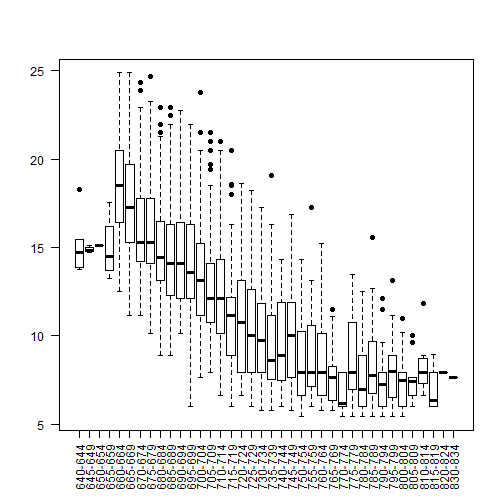
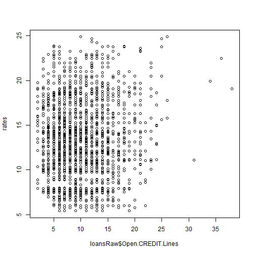
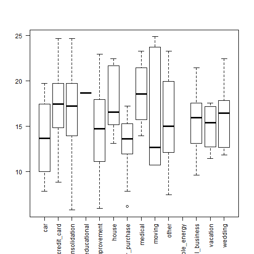

Raw Loan Analysis
========================

### Load libraries


```r
library(Hmisc)
```

```
## Loading required package: survival
```

```
## Loading required package: splines
```

```
## Hmisc library by Frank E Harrell Jr
## 
## Type library(help='Hmisc'), ?Overview, or ?Hmisc.Overview') to see overall
## documentation.
## 
## NOTE:Hmisc no longer redefines [.factor to drop unused levels when
## subsetting.  To get the old behavior of Hmisc type dropUnusedLevels().
```

```
## Attaching package: 'Hmisc'
```

```
## The following object(s) are masked from 'package:survival':
## 
## untangle.specials
```

```
## The following object(s) are masked from 'package:base':
## 
## format.pval, round.POSIXt, trunc.POSIXt, units
```


  
## Processing

Download the data, read the data in and save the raw data as an RDA file


```r
getwd()
```

```
## [1] "C:/dev/coursera/cour-dataanalysis/a1/code/rawcode"
```

```r
download.file("https://spark-public.s3.amazonaws.com/dataanalysis/loansData.csv", 
    destfile = "../../data/loansData.csv", method = "curl")
dateDownloaded <- date()
dateDownloaded
```

```
## [1] "Thu Feb 14 17:02:04 2013"
```

```r
loansRaw <- read.csv("../../data/loansData.csv")
save(loansRaw, dateDownloaded, file = "../../data/loansRaw.rda")
```


### Look at the data set


```r
head(loansRaw)
```

```
##       Amount.Requested Amount.Funded.By.Investors Interest.Rate
## 81174            20000                      20000         8.90%
## 99592            19200                      19200        12.12%
## 80059            35000                      35000        21.98%
## 15825            10000                       9975         9.99%
## 33182            12000                      12000        11.71%
## 62403             6000                       6000        15.31%
##       Loan.Length       Loan.Purpose Debt.To.Income.Ratio State
## 81174   36 months debt_consolidation               14.90%    SC
## 99592   36 months debt_consolidation               28.36%    TX
## 80059   60 months debt_consolidation               23.81%    CA
## 15825   36 months debt_consolidation               14.30%    KS
## 33182   36 months        credit_card               18.78%    NJ
## 62403   36 months              other               20.05%    CT
##       Home.Ownership Monthly.Income FICO.Range Open.CREDIT.Lines
## 81174       MORTGAGE           6542    735-739                14
## 99592       MORTGAGE           4583    715-719                12
## 80059       MORTGAGE          11500    690-694                14
## 15825       MORTGAGE           3833    695-699                10
## 33182           RENT           3195    695-699                11
## 62403            OWN           4892    670-674                17
##       Revolving.CREDIT.Balance Inquiries.in.the.Last.6.Months
## 81174                    14272                              2
## 99592                    11140                              1
## 80059                    21977                              1
## 15825                     9346                              0
## 33182                    14469                              0
## 62403                    10391                              2
##       Employment.Length
## 81174          < 1 year
## 99592           2 years
## 80059           2 years
## 15825           5 years
## 33182           9 years
## 62403           3 years
```

```r
summary(loansRaw)
```

```
##  Amount.Requested Amount.Funded.By.Investors Interest.Rate 
##  Min.   : 1000    Min.   :    0              12.12% : 122  
##  1st Qu.: 6000    1st Qu.: 6000              7.90%  : 119  
##  Median :10000    Median :10000              13.11% : 115  
##  Mean   :12406    Mean   :12002              15.31% :  76  
##  3rd Qu.:17000    3rd Qu.:16000              14.09% :  72  
##  Max.   :35000    Max.   :35000              14.33% :  69  
##                                              (Other):1927  
##     Loan.Length               Loan.Purpose  Debt.To.Income.Ratio
##  36 months:1952   debt_consolidation:1307   0%     :   8        
##  60 months: 548   credit_card       : 444   12.54% :   6        
##                   other             : 201   12.20% :   5        
##                   home_improvement  : 152   12.85% :   5        
##                   major_purchase    : 101   14.22% :   5        
##                   small_business    :  87   14.66% :   5        
##                   (Other)           : 208   (Other):2466        
##      State       Home.Ownership Monthly.Income     FICO.Range  
##  CA     : 433   MORTGAGE:1148   Min.   :   588   670-674: 171  
##  NY     : 255   NONE    :   1   1st Qu.:  3500   675-679: 166  
##  TX     : 174   OTHER   :   5   Median :  5000   680-684: 157  
##  FL     : 169   OWN     : 200   Mean   :  5689   695-699: 153  
##  IL     : 101   RENT    :1146   3rd Qu.:  6800   665-669: 145  
##  GA     :  98                   Max.   :102750   690-694: 140  
##  (Other):1270                   NA's   :1        (Other):1568  
##  Open.CREDIT.Lines Revolving.CREDIT.Balance Inquiries.in.the.Last.6.Months
##  Min.   : 2.0      Min.   :     0           Min.   :0.000                 
##  1st Qu.: 7.0      1st Qu.:  5586           1st Qu.:0.000                 
##  Median : 9.0      Median : 10962           Median :0.000                 
##  Mean   :10.1      Mean   : 15245           Mean   :0.906                 
##  3rd Qu.:13.0      3rd Qu.: 18889           3rd Qu.:1.000                 
##  Max.   :38.0      Max.   :270800           Max.   :9.000                 
##  NA's   :2         NA's   :2                NA's   :2                     
##  Employment.Length
##  10+ years:653    
##  < 1 year :250    
##  2 years  :244    
##  3 years  :235    
##  5 years  :202    
##  4 years  :192    
##  (Other)  :724
```

```r
sapply(loansRaw[1, ], class)
```

```
##               Amount.Requested     Amount.Funded.By.Investors 
##                      "integer"                      "numeric" 
##                  Interest.Rate                    Loan.Length 
##                       "factor"                       "factor" 
##                   Loan.Purpose           Debt.To.Income.Ratio 
##                       "factor"                       "factor" 
##                          State                 Home.Ownership 
##                       "factor"                       "factor" 
##                 Monthly.Income                     FICO.Range 
##                      "numeric"                       "factor" 
##              Open.CREDIT.Lines       Revolving.CREDIT.Balance 
##                      "integer"                      "integer" 
## Inquiries.in.the.Last.6.Months              Employment.Length 
##                      "integer"                       "factor"
```


### Find out about missing values

```r
sum(is.na(loansRaw))
```

```
## [1] 7
```


### Find minimum and maximum interest rates

```r
rates <- as.numeric(sub("%", "", loansRaw$Interest.Rate))
min(rates)
```

```
## [1] 5.42
```

```r
max(rates)
```

```
## [1] 24.89
```


### Find minimum and maximum debts to income ratio

```r
ratio <- as.numeric(sub("%", "", loansRaw$Debt.To.Income.Ratio))
min(ratio)
```

```
## [1] 0
```

```r
max(ratio)
```

```
## [1] 34.91
```


--------------------------

## Exploratory analysis

### Make some univariate plots/summaries


```r
hist(rates)
```

 

```r
hist(ratio)
```

 

```r
hist(log(loansRaw$Monthly.Income), breaks = 50)
```

 

```r
plot(loansRaw$FICO.Range, las = 2)
```

 

```r
hist(loansRaw$Amount.Requested)
```

 

```r
hist(loansRaw$Amount.Funded.By.Investors)
```

 

```r
hist(loansRaw$Open.CREDIT.Lines)
```

 

```r
hist(log(loansRaw$Revolving.CREDIT.Balance), breaks = 50)
```

 

```r
plot(loansRaw$Employment.Length, las = 2)
```

 

```r
plot(loansRaw$Home.Ownership, las = 2)
```

 


### Make some univariate tables

```r
table(loansRaw$FICO.Range)
```

```
## 
## 640-644 645-649 650-654 655-659 660-664 665-669 670-674 675-679 680-684 
##       5       3       1       4     125     145     171     166     157 
## 685-689 690-694 695-699 700-704 705-709 710-714 715-719 720-724 725-729 
##     138     140     153     131     134     112      93     114      94 
## 730-734 735-739 740-744 745-749 750-754 755-759 760-764 765-769 770-774 
##      94      65      53      54      61      46      46      36      17 
## 775-779 780-784 785-789 790-794 795-799 800-804 805-809 810-814 815-819 
##      22      28      19      20      13      13      11       8       6 
## 820-824 830-834 
##       1       1
```

```r
table(loansRaw$Interest.Rate)
```

```
## 
## 10.00% 10.08% 10.16% 10.20% 10.25% 10.28% 10.36% 10.37% 10.38% 10.46% 
##      8      2     48      1      8      1      8      8     12      1 
## 10.59% 10.62% 10.65% 10.74% 10.75% 10.83% 10.91% 10.95% 10.99% 11.03% 
##     13      5     14     24     11      2      1      1     20      4 
## 11.09% 11.11% 11.12% 11.14% 11.26% 11.36% 11.48% 11.49% 11.54% 11.58% 
##      1      6      8     58      2      4      6     21      1      2 
## 11.59% 11.66% 11.71% 11.78% 11.83% 11.86% 11.89% 11.97% 11.99% 12.12% 
##      1      1     36      2      8      7      9      3     14    122 
## 12.18% 12.21% 12.23% 12.29% 12.41% 12.42% 12.49% 12.53% 12.61% 12.68% 
##      4      5      3      2      1     17      1     10      5      7 
## 12.69% 12.73% 12.84% 12.86% 12.87% 12.92% 12.98% 12.99% 13.06% 13.11% 
##     21      2      5      1      4      3      4      6      8    115 
## 13.12% 13.16% 13.17% 13.22% 13.23% 13.24% 13.30% 13.35% 13.43% 13.47% 
##      1      4      1      2      5      2      2      2      4      3 
## 13.48% 13.49% 13.55% 13.57% 13.61% 13.67% 13.72% 13.75% 13.79% 13.80% 
##      4     25      1      1      2     23      2      2      2      1 
## 13.85% 13.87% 13.92% 13.93% 13.98% 13.99% 14.07% 14.09% 14.11% 14.12% 
##      4      2      2      1      8     29      2     72      7      1 
## 14.17% 14.18% 14.22% 14.26% 14.27% 14.33% 14.35% 14.42% 14.46% 14.50% 
##      3      1      4      2     18     69      4      2      3      1 
## 14.59% 14.61% 14.65% 14.70% 14.72% 14.74% 14.79% 14.82% 14.83% 14.84% 
##      5      4     29      2      3      2      2      2      3      2 
## 14.91% 14.96% 15.01% 15.05% 15.13% 15.20% 15.21% 15.23% 15.27% 15.28% 
##      5      6      1      4      2      1      5      7     10      2 
## 15.31% 15.33% 15.37% 15.45% 15.57% 15.58% 15.62% 15.65% 15.68% 15.70% 
##     76      3      1      1      1      5      3      3      1      1 
## 15.80% 15.81% 15.95% 15.96% 15.99% 16.00% 16.02% 16.07% 16.29% 16.32% 
##     39     10      5     10      7      2      2      2     51      8 
## 16.35% 16.40% 16.45% 16.49% 16.63% 16.69% 16.70% 16.71% 16.77% 16.82% 
##      1      2      1      8      1      1      1      1     11      5 
## 16.83% 16.89% 17.04% 17.14% 17.15% 17.19% 17.27% 17.43% 17.44% 17.49% 
##      1      9      1      4      1      1     56      1      1     10 
## 17.51% 17.54% 17.56% 17.58% 17.77% 17.80% 17.88% 17.90% 17.93% 17.99% 
##      3      1      3      6     38      1      1      1      3     12 
## 18.17% 18.25% 18.29% 18.30% 18.39% 18.49% 18.55% 18.62% 18.64% 18.67% 
##      1     19      1      1      3     33      7      1      8      2 
## 18.75% 18.79% 19.03% 19.04% 19.05% 19.13% 19.22% 19.41% 19.42% 19.47% 
##     17      3      7      1     26      1      9      1      3      1 
## 19.69% 19.72% 19.74% 19.91% 19.99% 20.25% 20.30% 20.49% 20.50% 20.52% 
##      5     19      2      5      7      2      3     18      6      1 
## 20.53% 20.77% 20.89% 20.99% 21.00% 21.14% 21.27% 21.28% 21.48% 21.49% 
##      1      2      1      1     12      1      1      1      4     12 
## 21.67% 21.74% 21.97% 21.98% 22.11% 22.45% 22.47% 22.78% 22.95% 23.28% 
##      2      2      3     10      2      3     15      5      8      7 
## 23.33% 23.63% 23.76% 23.83% 23.91% 24.20% 24.33% 24.70% 24.89%  5.42% 
##      1      1      7      2      1      1      1      2      2     11 
##  5.79%  5.99%  6.00%  6.03%  6.17%  6.54%  6.62%  6.76%  6.91%  6.92% 
##     14     10      1     57      5      6     49      4      9      5 
##  6.99%  7.14%  7.29%  7.40%  7.43%  7.49%  7.51%  7.62%  7.66%  7.68% 
##      9      7     10      3      1     23     21     34      8      3 
##  7.74%  7.75%  7.88%  7.90%  7.91%  8.00%  8.07%  8.32%  8.49%  8.59% 
##      5      2     17    119      3      4      1      2     10      7 
##  8.63%  8.88%  8.90%  8.94%  9.07%  9.20%  9.25%  9.32%  9.33%  9.62% 
##      2      3     64      7      2      1      3      4      1      3 
##  9.63%  9.76%  9.88%  9.91%  9.99% 
##     11     21      4     13     11
```

```r
table(loansRaw$Loan.Length)
```

```
## 
## 36 months 60 months 
##      1952       548
```

```r
table(loansRaw$State)
```

```
## 
##  AK  AL  AR  AZ  CA  CO  CT  DC  DE  FL  GA  HI  IA  IL  IN  KS  KY  LA 
##  11  38  13  46 433  61  50  11   8 169  98  12   1 101   3  21  23  22 
##  MA  MD  MI  MN  MO  MS  MT  NC  NH  NJ  NM  NV  NY  OH  OK  OR  PA  RI 
##  73  68  45  38  33   1   7  64  15  94  13  32 255  71  21  30  96  15 
##  SC  SD  TX  UT  VA  VT  WA  WI  WV  WY 
##  28   4 174  16  78   5  58  26  15   4
```

```r
table(loansRaw$Loan.Purpose)
```

```
## 
##                car        credit_card debt_consolidation 
##                 50                444               1307 
##        educational   home_improvement              house 
##                 15                152                 20 
##     major_purchase            medical             moving 
##                101                 30                 29 
##              other   renewable_energy     small_business 
##                201                  4                 87 
##           vacation            wedding 
##                 21                 39
```

```r
table(loansRaw$Home.Ownership)
```

```
## 
## MORTGAGE     NONE    OTHER      OWN     RENT 
##     1148        1        5      200     1146
```

```r
table(loansRaw$Inquiries.in.the.Last.6.Months)
```

```
## 
##    0    1    2    3    4    5    6    7    8    9 
## 1250  657  336  169   50   14    8    7    2    5
```

```r
table(loansRaw$Employment.Length)
```

```
## 
##  < 1 year    1 year 10+ years   2 years   3 years   4 years   5 years 
##       250       177       653       244       235       192       202 
##   6 years   7 years   8 years   9 years       n/a 
##       163       127       108        72        77
```


### Plot rate by FICO

```r
plot(loansRaw$FICO.Range, rates, pch = 19, las = 2)
```

 


Have correlation between FICO and Rate.
Than bigger FICO than less Rate. 
Since FICO is aggregation of other factors, cofounders should be found

### Plot Rate by FICO with color groups for loan lengths 

```r
plot(as.numeric(loansRaw$FICO.Range), rates, pch = 19, col = loansRaw$Loan.Length)
```

 

Rates smaller than loan length smaller.

### Plot Rate by Ratio

```r
plot(ratio, rates, pch = 19, col = loansRaw$Loan.Length)
```

 

No obvious correlation

### Plot rate by income

```r
plot(log(loansRaw$Monthly.Income), rates, pch = 19, col = loansRaw$Loan.Length)
```

 

Again no obvious correlation here

### Plot rate by employment length

```r
plot(loansRaw$Employment.Length, rates, pch = 19, las = 2, col = loansRaw$Loan.Length)
```

 

No correlation here

### Plot rate by credit lines

```r
plot(loansRaw$Open.CREDIT.Lines, rates)
```

 


### Plot rate by purpose

```r
plot(loansRaw$Loan.Purpose, rates, las = 2)
```

 

In general car, educational and energy has lower rate, maby because they are short term and then loan length is cofounder here


### Plot rate by purpose (long teram term)

```r
plot(loansRaw$Loan.Purpose[as.numeric(loansRaw$Loan.Length) == 2], rates[as.numeric(loansRaw$Loan.Length) == 
    2], las = 2)  #, cex=as.numeric(loansRaw$Loan.Length), col=as.numeric(loansRaw$Open.CREDIT.Lines))
```

 


### Plot rate by Inquiries.in.the.Last.6.Months 

```r
plot(loansRaw$Inquiries.in.the.Last.6.Months, rates, col = loansRaw$Loan.Length)
```

 

Than more quantity of inquires than more rate (at least this works after 3)


This is evident what main factors which impact rate are FICO and loan length. Loan length in own way is an aggregated value http://en.wikipedia.org/wiki/Credit_score_in_the_United_States.

Now lets try to indentify whats else could affect rate.

------

## Modeling

### Fit a rates by FICO.Range

```r
lm1 <- lm(rates ~ loansRaw$FICO.Range)
summary(lm1)
```

```
## 
## Call:
## lm(formula = rates ~ loansRaw$FICO.Range)
## 
## Residuals:
##    Min     1Q Median     3Q    Max 
## -8.147 -2.041 -0.492  1.666 10.403 
## 
## Coefficients:
##                            Estimate Std. Error t value Pr(>|t|)    
## (Intercept)                 15.2120     1.2697   11.98  < 2e-16 ***
## loansRaw$FICO.Range645-649  -0.3287     2.0734   -0.16  0.87406    
## loansRaw$FICO.Range650-654  -0.0820     3.1101   -0.03  0.97897    
## loansRaw$FICO.Range655-659  -0.2820     1.9045   -0.15  0.88230    
## loansRaw$FICO.Range660-664   3.2805     1.2948    2.53  0.01135 *  
## loansRaw$FICO.Range665-669   2.2361     1.2914    1.73  0.08348 .  
## loansRaw$FICO.Range670-674   1.0365     1.2881    0.80  0.42110    
## loansRaw$FICO.Range675-679   0.6427     1.2887    0.50  0.61801    
## loansRaw$FICO.Range680-684  -0.0853     1.2897   -0.07  0.94727    
## loansRaw$FICO.Range685-689  -0.5571     1.2925   -0.43  0.66646    
## loansRaw$FICO.Range690-694  -0.4799     1.2922   -0.37  0.71036    
## loansRaw$FICO.Range695-699  -1.0651     1.2903   -0.83  0.40915    
## loansRaw$FICO.Range700-704  -1.8551     1.2937   -1.43  0.15170    
## loansRaw$FICO.Range705-709  -2.5521     1.2931   -1.97  0.04854 *  
## loansRaw$FICO.Range710-714  -2.7789     1.2977   -2.14  0.03234 *  
## loansRaw$FICO.Range715-719  -4.0301     1.3034   -3.09  0.00201 ** 
## loansRaw$FICO.Range720-724  -4.1762     1.2972   -3.22  0.00130 ** 
## loansRaw$FICO.Range725-729  -4.5590     1.3030   -3.50  0.00048 ***
## loansRaw$FICO.Range730-734  -5.2558     1.3030   -4.03  5.7e-05 ***
## loansRaw$FICO.Range735-739  -5.5885     1.3176   -4.24  2.3e-05 ***
## loansRaw$FICO.Range740-744  -5.6197     1.3282   -4.23  2.4e-05 ***
## loansRaw$FICO.Range745-749  -5.3103     1.3272   -4.00  6.5e-05 ***
## loansRaw$FICO.Range750-754  -6.7443     1.3207   -5.11  3.5e-07 ***
## loansRaw$FICO.Range755-759  -6.2159     1.3369   -4.65  3.5e-06 ***
## loansRaw$FICO.Range760-764  -6.5844     1.3369   -4.93  9.0e-07 ***
## loansRaw$FICO.Range765-769  -7.4287     1.3550   -5.48  4.6e-08 ***
## loansRaw$FICO.Range770-774  -8.4591     1.4444   -5.86  5.4e-09 ***
## loansRaw$FICO.Range775-779  -6.4679     1.4066   -4.60  4.5e-06 ***
## loansRaw$FICO.Range780-784  -7.6227     1.3784   -5.53  3.5e-08 ***
## loansRaw$FICO.Range785-789  -6.7141     1.4270   -4.71  2.7e-06 ***
## loansRaw$FICO.Range790-794  -7.6515     1.4195   -5.39  7.7e-08 ***
## loansRaw$FICO.Range795-799  -6.8205     1.4940   -4.57  5.2e-06 ***
## loansRaw$FICO.Range800-804  -7.5735     1.4940   -5.07  4.3e-07 ***
## loansRaw$FICO.Range805-809  -7.7856     1.5313   -5.08  4.0e-07 ***
## loansRaw$FICO.Range810-814  -6.9183     1.6185   -4.27  2.0e-05 ***
## loansRaw$FICO.Range815-819  -8.2870     1.7192   -4.82  1.5e-06 ***
## loansRaw$FICO.Range820-824  -7.3120     3.1101   -2.35  0.01880 *  
## loansRaw$FICO.Range830-834  -7.5920     3.1101   -2.44  0.01471 *  
## ---
## Signif. codes:  0 '***' 0.001 '**' 0.01 '*' 0.05 '.' 0.1 ' ' 1 
## 
## Residual standard error: 2.84 on 2462 degrees of freedom
## Multiple R-squared: 0.545,	Adjusted R-squared: 0.538 
## F-statistic: 79.7 on 37 and 2462 DF,  p-value: <2e-16
```

```r
# confint(lm1) anova(lm1)
plot(loansRaw$FICO.Range, rates)
points(loansRaw$FICO.Range, lm1$fitted, pch = 19, col = "red")
```

 


### Fit a rates by Length
```
lm2 <- lm(rates ~loansRaw$Loan.Length)
plot(loansRaw$Loan.Length, rates)
points(loansRaw$Loan.Length, lm2$fitted,pch=19,col="red")

#summary(lm2)
#confint(lm2)
#anova(lm2) 

```

### Fit a rates by Amount.Requested
```
lm3 <- lm(rates ~loansRaw$Amount.Requested)
plot(loansRaw$Amount.Requested, rates)
points(loansRaw$Amount.Requested, lm3$fitted,pch=19,col="red")
#summary(lm3)
#confint(lm3)
#anova(lm3) 
```

###Fit a rates by loansRaw$Amount.Funded.By.Investors
```
lm4 <- lm(rates ~ loansRaw$Amount.Funded.By.Investors)
plot(loansRaw$Amount.Funded.By.Investors, rates)
points(loansRaw$Amount.Funded.By.Investors, lm4$fitted,pch=19,col="red")
#summary(lm4)
#confint(lm4)
#anova(lm4) 
```

###Fit a rates by loansRaw$Loan.Purpose
```
lm5 <- lm(rates ~ relevel(loansRaw$Loan.Purpose, ref="debt_consolidation"))
plot(loansRaw$Loan.Purpose, rates, las=2)
points(loansRaw$Loan.Purpose, lm5$fitted,pch=19,col="red")
#summary(lm5)
#confint(lm5)
#anova(lm5) 
```

###Fit a rates by ratio
```
ratioGroups = cut(ratio,10)
lm6 <- lm(rates ~ ratioGroups)
plot(ratioGroups, rates, las=2)
points(ratioGroups, lm6$fitted,pch=19,col="red")
#summary(lm6)
#confint(lm6)
#anova(lm6) 
```

###Fit a rates by ratio
```
lm7 <- lm(rates ~ loansRaw$State)
plot(loansRaw$State, rates, las=2)
points(loansRaw$State, lm7$fitted,pch=19,col="red")
#summary(lm7)
#confint(lm7)
#anova(lm7) 
```

###Fit a rates by Ownership
```
lm8 <- lm(rates ~ loansRaw$Home.Ownership)
plot(loansRaw$Home.Ownership, rates, las=2)
points(loansRaw$Home.Ownership, lm8$fitted,pch=19,col="red")
#summary(lm8)
#confint(lm8)
#anova(lm8) 
```

###Fit a rates by Monthly.Income
```
lm9 <- lm(rates ~ loansRaw$Monthly.Income)
plot(loansRaw$Monthly.Income, rates, las=2)
points(loansRaw$Monthly.Income, lm9$fitted,pch=19,col="red")
#summary(lm9)
#confint(lm9)
#anova(lm9) 
```

###Fit a rates by Open.CREDIT.Lines
```
lm10 <- lm(rates ~ loansRaw$Open.CREDIT.Lines)
plot(loansRaw$Open.CREDIT.Lines, rates, las=2)
points(loansRaw$Open.CREDIT.Lines, lm10$fitted,pch=19,col="red")
#summary(lm10)
#confint(lm10)
#anova(lm10) 
```

###Fit a rates by Inquiries.in.the.Last.6.Months
```
lm11 <- lm(rates ~ loansRaw$Inquiries.in.the.Last.6.Months)
plot(loansRaw$Inquiries.in.the.Last.6.Months, rates)
points(loansRaw$Inquiries.in.the.Last.6.Months, lm11$fitted,pch=19,col="red")
#summary(lm11)
#confint(lm11)
#anova(lm11) 
```

###Fit a rates by loansRaw$Employment.Length
```
lm12 <- lm(rates ~ loansRaw$Employment.Length)
plot(loansRaw$loansRaw$Employment.Length, rates)
points(loansRaw$loansRaw$Employment.Length, lm12$fitted,pch=19,col="red")
#summary(lm12)
#confint(lm12)
#anova(lm12) 
```
